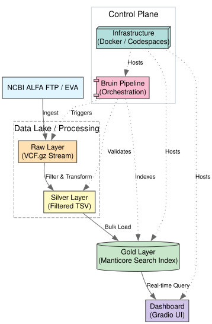

# Genomic Variant Population Frequency Pipeline: Medallion Architecture

[](https://github.com/DataTalksClub/data-engineering-zoomcamp)
[](https://getbruin.com)
[](https://manticoresearch.com)
[](https://gradio.app)

## 1. Project Overview
This project implements an end-to-end data engineering pipeline to ingest, transform, and serve genomic variation data from the **NCBI ALFA (Allele Frequency Aggregator)** project. Using a **Medallion Architecture** (Raw → Silver → Gold), we process over 1.6 million genomic variants across 12 diverse global populations, providing a high-performance search engine and an interactive dashboard for researchers.

### The Problem
Genomic data (VCF files) is notoriously difficult to query. Raw files are massive, and traditional SQL databases are often too slow for millions of real-time "rsID" lookups. Researchers need a way to visualize ethnic allele frequencies (e.g., European vs. East Asian) with sub-second latency.

---

## 2. Architecture Diagram
The pipeline follows a modern data stack centered around performance and reproducibility.



---

## 3. Technology Stack & Design Decisions
| Layer | Tool | Rationale |
| :--- | :--- | :--- |
| **Orchestration** | **Bruin** | A modern, Python/SQL-native orchestrator. Chosen over Airflow for its lightweight footprint and excellent handling of data asset dependencies. |
| **Data Processing**| **bcftools & awk** | Industry-standard tools for high-speed VCF streaming. Used to calculate allele frequencies on-the-fly from AC (Allele Count) and AN (Allele Number). |
| **Data Warehouse** | **Manticore Search**| Served as our "Gold Layer". Optimized for full-text search (Variant IDs) and analytical queries with sub-millisecond response times. |
| **Visualization** | **Gradio + Plotly** | Provides a professional interactive interface with real-time distribution plots and categorical bar charts of 12 populations. |
| **Containerization**| **Docker** | Ensures "Zero-Config" reproducibility for reviewers using either Docker Compose or a consolidated Cloud Run Dockerfile. |

---

## 4. Medallion Data Layers
*   **Raw Layer (`/data/raw`)**: Original VCF format subset from NCBI FTP. Preserved in compressed `.vcf.gz` to maintain data lineage.
*   **Silver Layer (`/data/silver`)**: Structured `.tsv` data. Includes calculated allele frequencies for 12 populations (AFR, AMR, EAS, EUR, SAS, AJ, FIPA, CAU, OTH, APL, ASN, AMR_CAU).
*   **Gold Layer (Manticore Index)**: Search-optimized table `eva_variants`. Features infix indexing for flexible variant searching.

---

## 5. Technical Highlights (Work Accomplished)
- **Consolidated Build Pipeline**: Developed a `Dockerfile.cloudrun` that **"bakes"** the data into the image during build time. This ensures the Cloud Run instance starts with a fully populated DWH without runtime delays.
- **Robustness**: Implemented 141 (SIGPIPE) signal handling in the streaming pipeline to allow efficient subsetting of massive genomic files without breaking the build process.
- **Data Quality**: Used Bruin's validation features and Python-based error checking to handle NULLs and contig-header discrepancies in public NCBI data.
- **Multi-Service Entrypoint**: Custom `deploy-entrypoint.sh` that manages both the Manticore search engine and the Gradio dashboard concurrently within a single container.

---

## 6. How to Reproduce (Reviewer Guide)

### Option A: 🚀 Quick Start with GitHub Codespaces (One-Click)
This project is pre-configured for **Zero-Config reproduction** using GitHub Codespaces.
1.  **Launch**: Click the **Code** button in this repo, select the **Codespaces** tab, and click **Create codespace on main**.
2.  **Wait for provision**: The environment will automatically install Docker-in-Docker and forward the necessary ports (7860 for Dashboard, 9308 for Manticore).
3.  **Run Pipeline**:
    ```bash
    ./start-services.sh
    ./run-etl-pipeline.sh
    ```
4.  **View Results**: VS Code will show a notification that ports are forwarded. Open the local address for port `7860` to see the dashboard.

### Option B: Local Development (Docker Compose)
Ideal for seeing the agents in action on your machine.
1.  **Start Services**:
    ```bash
    ./start-services.sh
    ```
2.  **Execute Pipeline**:
    ```bash
    ./run-etl-pipeline.sh
    ```
3.  **Access Dashboard**: Visit `http://localhost:7860` in your browser.

### Option C: Production Container (Cloud Run Mode)
This build will run the ETL **internally** during construction.
1.  **Build and Run**:
    ```bash
    docker build -f deploy/Dockerfile.cloudrun -t eva-cloudrun .
    docker run -p 8080:8080 eva-cloudrun
    ```
2.  **Access Dashboard**: Visit `http://localhost:8080`.

---

## 7. Submission Checklist
- [x] **Containerization**: Full Docker support.
- [x] **Cloud/IaC**: Consolidated Docker strategy for Google Cloud Run.
- [x] **Orchestration**: End-to-end Bruin DAG.
- [x] **DWH**: Manticore Search with explicit indexing.
- [x] **Dashboard**: 2+ interactive tiles (Search, Distribution, Frequencies).
- [x] **Reproducibility**: One-script setup (`start-services.sh`).

---
**Author:** Data Engineering Zoomcamp 2026 Project
**Data Source:** [NCBI ALFA Project](https://www.ncbi.nlm.nih.gov/snp/docs/gsr/alfa/)
